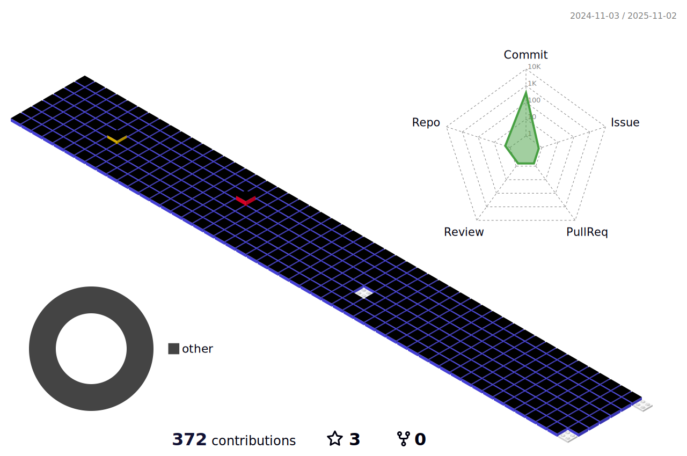

<!-- <h2 align="center"> 🙋‍♀️ Profile </h2>  -->

<!-- - Univ : Tech University of Korea  -->
<!-- > Major : IT Management & Computer Science and Engineering  -->
<!-- > E-mail : dmswnehf@naver.com  -->
<!-- [Blog](https://j-tech-dev.tistory.com/) ⎮ [Resume](https://www.notion.so/c4c8af7f5b194fea8ad88a841470492a) -->

<!-- Blog :   
Resume : <a href="https://www.notion.so/c4c8af7f5b194fea8ad88a841470492a"> -->

 
  
## 🖥️ Tech Stack
<!-- ### 🌸 I have experienced 🌸 -->
<!-- ### 🍀 I'm currently studying 🍀 -->
###### Frontend  
     

 

  

###### backend  
        

###### DevOps  
      

###### Monitoring  
   

###### ETC  
  

    
  
<!-- 
<a href="https://github.com/dmswn1004">
   -->
  
</a>

